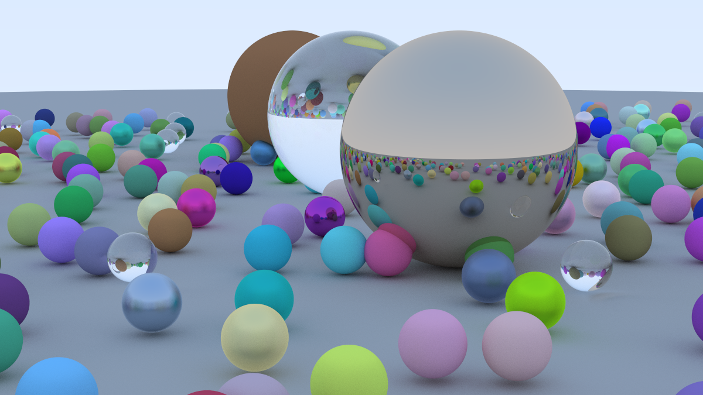

# Ray Tracing in One Weekend



This Rust project is based on the book [Ray Tracing in One Weekend](https://misterdanb.github.io/raytracinginrust/). It implements a simple ray tracer that generates an image using ray casting techniques.

## Requirements

- Rust (stable) 

## Installation

1. Clone this repository to your local machine.
2. Open a terminal and navigate to the root directory of the project.
3. Run the following command to build and run the project:

```bash
cargo run
```

The generated image will be saved as `image.png` in the project directory.

## Usage

To run the project, use the following command:

```bash
cargo run
```

This will generate an image named `image.png` in the project directory. You can modify the code in `main.rs` to create your own custom scenes by adjusting the camera parameters, adding objects, and changing the background color.

## Credits

This project is based on the book [Ray Tracing in One Weekend](https://misterdanb.github.io/raytracinginrust/) by Peter Shirley. The code for image processing is provided by the `image` crate, and the 3D vector math is provided by the `nalgebra` crate.